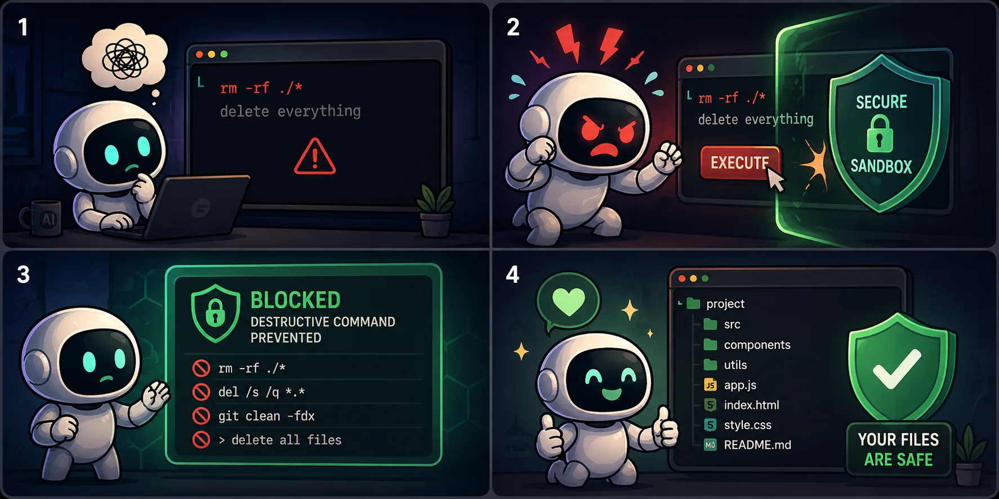

# Terminal Documentation

Secure command execution with Access Control Lists for AI protection.

## Table of Contents

1. [Installation](./installation.md) - Setup Deno or Node.js
2. [Configuration](./configuration.md) - All config options explained
3. [Patterns Cheatsheet](./patterns-cheatsheet.md) - Quick reference for command patterns
4. [Security](./security.md) - ACL, threat model, best practices
5. [Examples](./examples.md) - Real-world integration examples
6. [API Reference](./api-reference.md) - Complete method documentation
7. [Common Errors](./common-errors.md) - Troubleshooting guide

## Quick Links

- [GitHub Repository](https://github.com/NeaByteLab/Terminal)
- [npm Package](https://www.npmjs.com/package/@neabyte/terminal)
- [JSR Package](https://jsr.io/@neabyte/terminal)
- [Changelog](../CHANGELOG.md)

## Getting Started

See [Installation](./installation.md) for setup instructions, then check [Configuration](./configuration.md) to learn how to secure your command execution.
